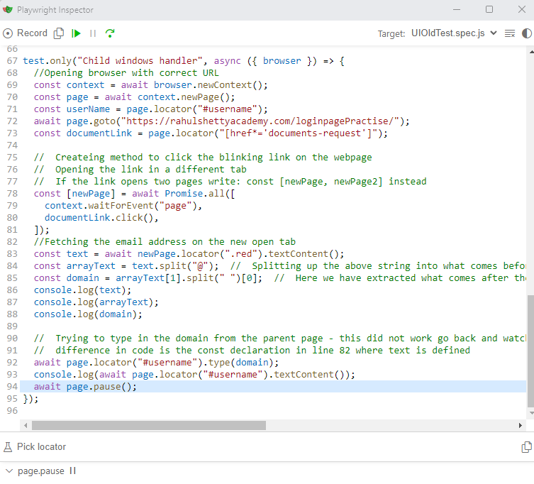

# Automated testing with Playwright

This project was created to get some experience with Playwright. When I get skilled enough I will start using Playwright in my other projects.

## About the Setup

### `Creation of the project`

This project was created in VsCode using:  

`npm install -g` to install npm globally 
`npm init playwright` to install Playwright skeleton and dependencies. 

Install node.js [here](https://nodejs.org/)  
Install VSCode [here](https://code.visualstudio.com/download)  

### `Imports used`

The imports i used for this project was:  

**Prettier in VSCode**  

##

### `Example test`

Here is an example test showing the us of Playwright inspector in the middle of an automation.  
These tests give instructions on what order each action should be done in.  

To closer inspect each step of an automation that might just take two seconds i use,  
the "await page.pause()" to stop and inspect before i let the test run further.

